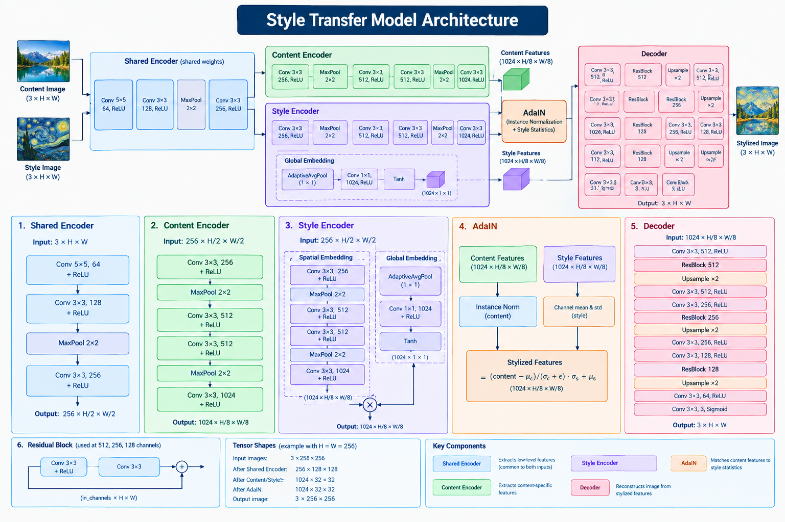

# stylze

**Author:** Charlie Clark \
**Date Started:** 2026-09-12

## Contents

1. [What is stylyze](#what-is-stylyze)
2. [How does stylyze work?](#how-does-stylyze-work)

## What is stylyze?

stylyze is a neural style transfer (NST) application. The user uploads both a real-world photograph (the content image) and a painting (the style image). Using a custom deep neural architecture, stylyze will transfer the artistic style from the uploaded painting to the user's real-world photograph. stylyze can do this without ever having previously seen either the content image or the style image.

## How does stylyze work?

Stylyze uses a custom deep neural architecture -- stylyze-v1 -- to perform the NST task. The figure below depicts the architecture in an easy-to-read manner.

### How was stylyze-v1 trained?

The stylyze-v1 model was trained using the GradNorm-weighted additive combination of style loss, identity loss, total variation loss, and a VGG19-based perceptual content loss. Training was done over 10 epochs with a batch size of 8, where MS-COCO 2017 was the content image dataset and WikiArt served as the style image dataset. It also utilizes an AdaIN module.

stylyze-v1 was designed and trained with zero-shot arbitrary NST as the goal.